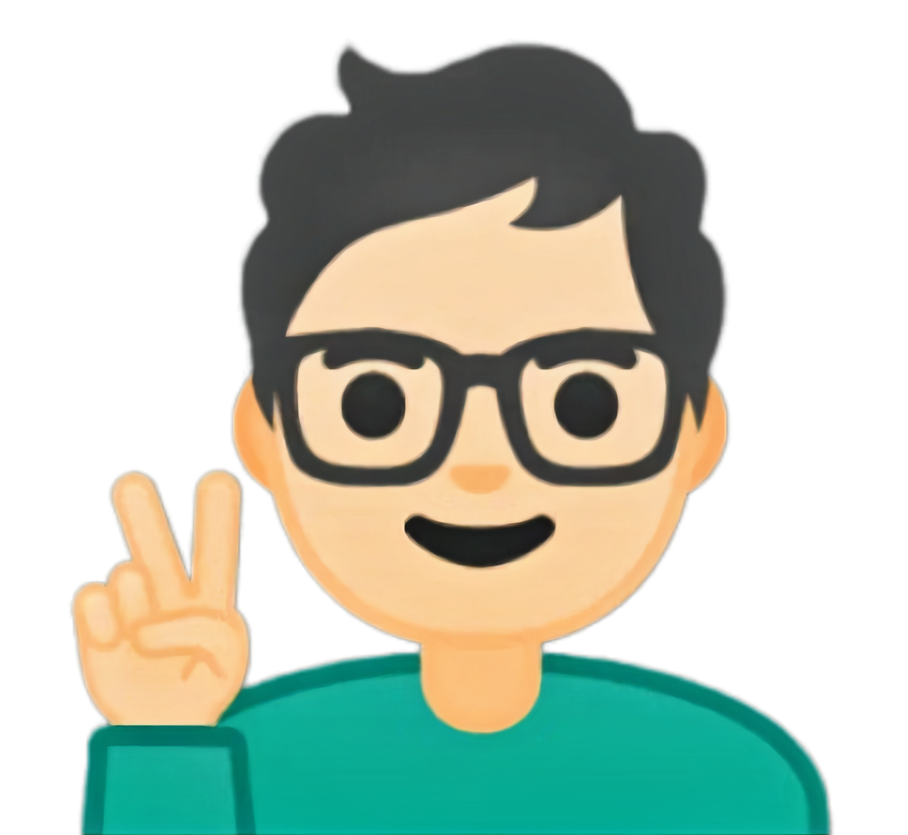
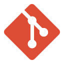
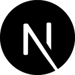
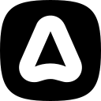
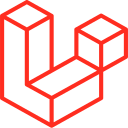

<!-- Link para o meu portfólio: -->

    <a target="_blank" href="https://thiagosl.netlify.app/">
      
      <h4 align="center">Visite meu portfólio! ☝🏼</h4>
    </a>

<!-- Divisor animado em GIF: -->

    

  &nbsp;
  

  <!-- Badge - Profile View Counter -->
   

  <!-- Badge - LinkedIn -->
  
  &nbsp;
  <!-- Badge - Email -->
  
  &nbsp;
<!-- Badge - My Settings -->
  
 

 
<!-- Segunda Linha de Badges: -->

 

<!-- Badge - Behance -->
  
   &nbsp;
    <!-- Badge - Instagram -->
  

<!-- Apresentação -->

###  Oi, meu nome é Thiago da Silva Lopes!

Atualmente eu estudo Análise e Desenvolvimento de Sistemas na <strong> <a target="_blank" href="https://www.linkedin.com/company/fatec-zona-sul?originalSubdomain=br">FATEC Zona Sul</a></strong>, e viso aprender cada vez mais, para se tornar um <strong>UX/UI Designer</strong>, e um programador <strong>Front End experiente</strong>;

Te convido a visitar meus repositórios e meu <strong><a target="_blank" href="https://www.linkedin.com/in/thiagosilvaloopes/">LinkedIn</a></strong>, onde você pode ver meus projetos. Sejam eles já desenvolvidos, ou em desenvolvimento. Juntamente com minhas habilidades em <strong>UX/UI, Front End e Back End. 🤟🏼😁☺</strong>

---

<!-- ReadMe em EN & PT-BR: -->
<table align="right">
 <td>Idioma do Conteúdo:</td>
 <tr><td align="center"><a href="README.md">Inglês</a></td></tr>
 <tr><td align="center"><a href="README_PT-BR.md">Português</a></td></tr>
</table>

### 🎯 Objetivos

📌 Dominar as linguagens/ferramentas mais atuais e utilizadas;

📌 Se aprofundar cada vez mais na minha área profissional;

📌 Entrar no mercado de trabalho como <strong>Desenvolvedor Front End Jr</strong> ou <strong>UX/UI Designer Jr</strong> 🎆

---

### 👨🏻‍💻 Tecnologias

<!-- GIF Gato digitando :p -->

**📚 Estou estudando:**

  <!-- Figma Icon -->
  &nbsp;
  <!--AdobeXD Icon -->
  &nbsp;
  <!-- HTML Icon -->
  &nbsp;
  <!-- CSS Icon -->
  &nbsp;
  <!-- JS Icon -->
  &nbsp;
  <!-- AdobePS Icon
  &nbsp;-->
  <!-- Git Icon 
  &nbsp;-->
  <!-- Sass Icon -->
  &nbsp;
  <!--VueJS Icon-->
  &nbsp;
  <!--NuxtJS Icon-->
  &nbsp;
  <!-- React Icon -->
  &nbsp;
  <!-- NextJS Icon -->
  &nbsp;

**🚀 Tenho interesse:**

  <!-- TS Icon -->
  &nbsp;
  <!-- NodeJS Icon -->
  &nbsp;
  <!-- AdonisJS Icon -->
  &nbsp;
  <!-- Laravel Icon -->
  &nbsp;
  <!-- PHP Icon -->
  &nbsp;

<!--Add a line to split sections-->

---

<!--Configs on: https://github.com/anuraghazra/github-readme-stats
-->

